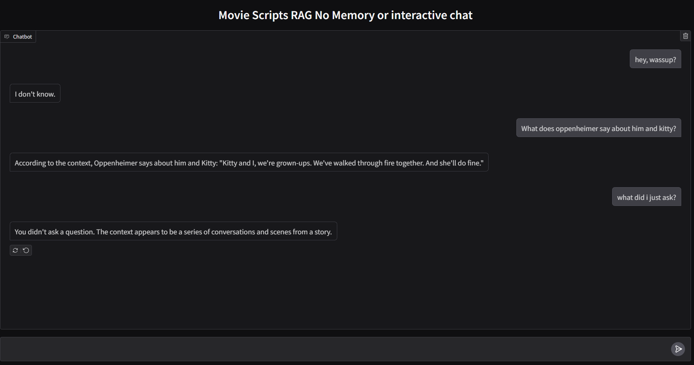
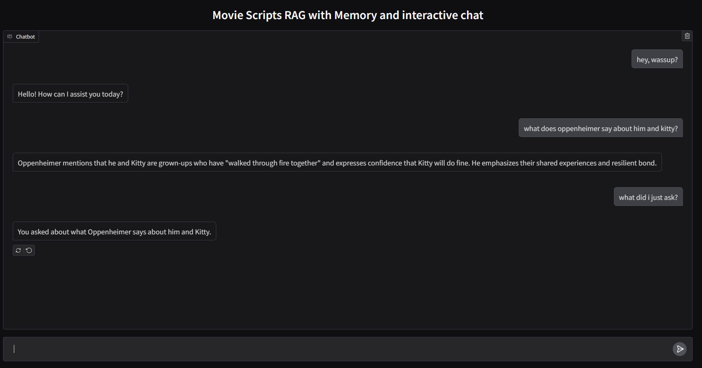

   ## Overview
   **Movie-scripts-RAG** is a conversational chat application that leverages vector databases to store and retrieve movie scripts. It enables contextual question-answering based on stored content while also providing general conversational capabilities, allowing users to interact beyond script-based queries.

   ## Features
   - **Movie Script-Based Question Answering:**  
     Stores and retrieves movie scripts from a vector database to provide relevant responses based on users’ questions.
   - **Conversational Chat System:**  
     Implements a message state graph using [Langraph](https://github.com/blackhc/langraph), making interactions more dynamic and allowing responses beyond database-dependent queries.
   - **Two Chat Modes:**
     1. **Simple Chat System:** Answers one question at a time without remembering chat history. (available in the simple_gradio_app.py file)
     2. **Interactive Chat System:** Maintains chat history and handles general conversations using **MemorySaver Checkpointer** in Langraph. (available in the interactive_gradio_app.py file)
   - **Efficient PDF Processing:**  
     Uses [PyPDF2](https://pypi.org/project/PyPDF2/) to extract text from movie script PDFs.
   - **Optimized Text Chunking:**  
     Leverages [LangChain’s Recursive Text Splitter](https://python.langchain.com/docs/modules/data_connection/document_loaders/document_transformation) to manage and structure script content efficiently.
   - **Web Interface:**  
     Built with [Gradio](https://gradio.app/) for a user-friendly, web-based experience.
   ## Demonstration

   Below is a screenshot of the **Simple Chat** mode:
   
   
   
   And here is the **Interactive Chat** mode with memory and dynamic conversation:
   
   


   ## Installation

   1. **Clone the repository**


   2. **Install dependencies:**
      ```bash
      pip install -r requirements.txt
      ```

   3. **Set up API keys:**
      - Create a `.env` file in the root directory.
      - Add the necessary API keys (default is OpenAI API Key).  
        If using a different LLM provider, adjust the code accordingly.  
        
        **Example**:
        ```
        OPENAI_API_KEY=your-api-key-here
        ```

   ## Usage
   The vector base is already available in this repo, If needed to add more data or create a different vector database look into the ipynb file for the steps.
   1. **Run the application:**
      ```bash
      python simple_gradio_app.py
      ```
      ```bash
      python interactive_gradio_app.py
      ```
   3. Once the application is running, the application should open in your browser if not opened then provide the local URL (http://127.0.0.1:7860) in your web browser.

   ## Note:
   This is a project i did for my own learning process. If you find any mistakes or upgrades that are necessary kindly ping me, Thank You.
